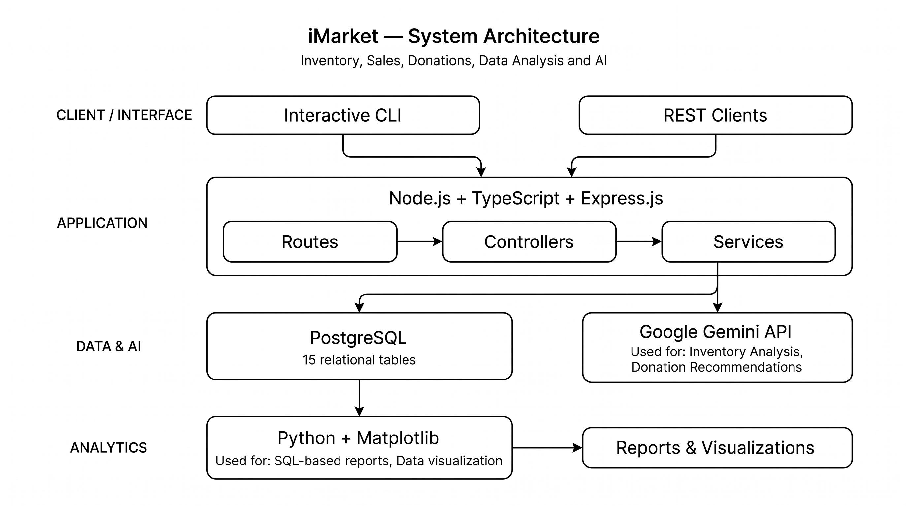
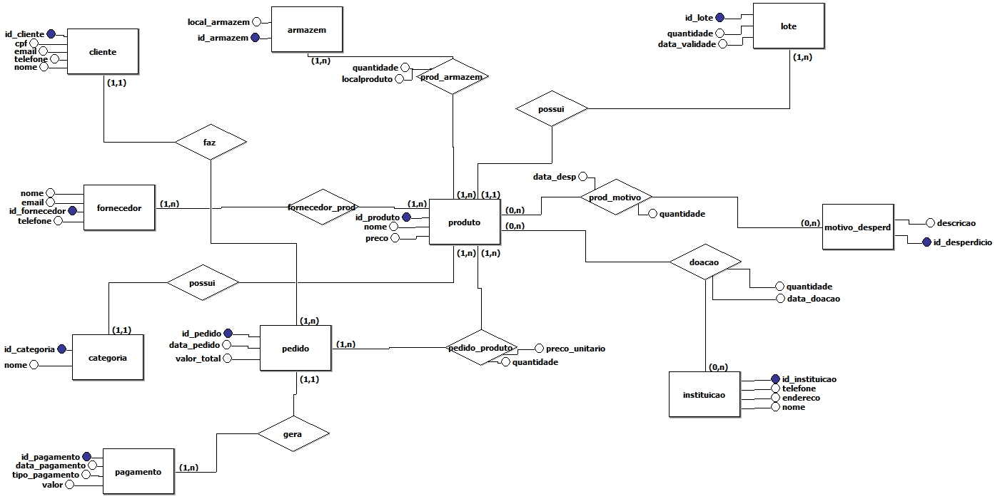
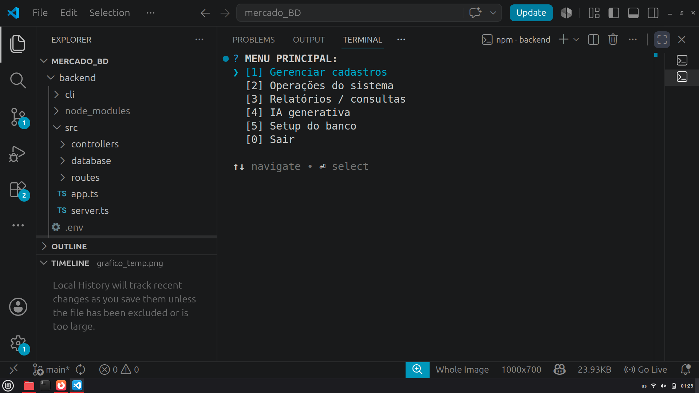
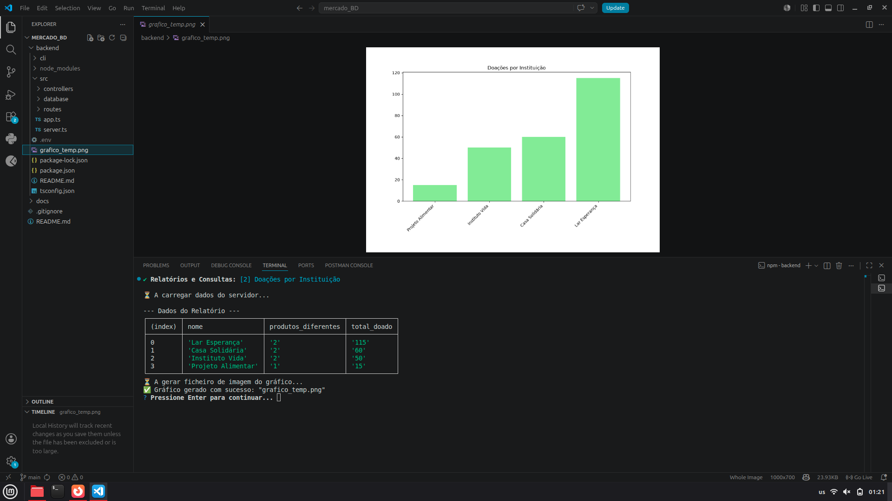
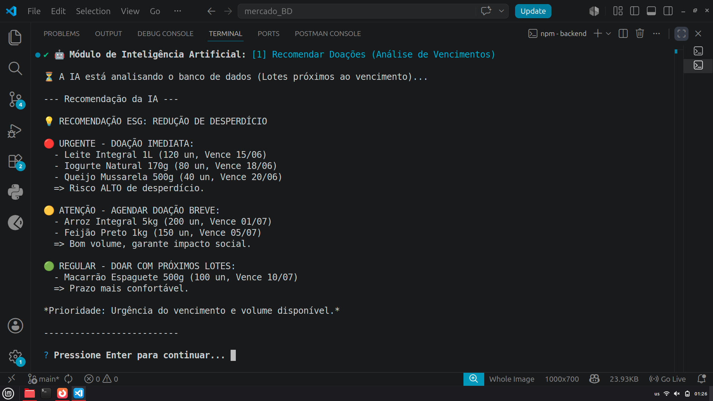

# 🛒 iMarket — Intelligent Market Management System

> A backend system for managing inventory, sales, suppliers, donations and stock analysis, built with PostgreSQL, Node.js, TypeScript, Python and Google Gemini.

[](https://nodejs.org/)
[](https://www.typescriptlang.org/)
[](https://expressjs.com/)
[](https://www.postgresql.org/)
[](https://www.python.org/)
[](https://ai.google.dev/)

---

## 📌 Overview

**iMarket** is a market management system designed to support day-to-day operations involving products, inventory, sales, suppliers, donations and waste management.

The project combines a REST API, a command-line interface, a relational database, data analysis and Generative AI.

The main goal was to build a complete backend-oriented system while applying database modeling, SQL, software architecture and data analysis concepts.

---

## 🎯 Key Features

* Product management
* Supplier management
* Inventory management
* Warehouse management
* Sales management
* Payment records
* Waste tracking
* Donation management
* SQL-based reports
* Python data visualization
* AI-powered inventory analysis
* AI-assisted donation recommendations
* Interactive command-line interface
* REST API

---

## 🏗️ Architecture



The system is organized around a Node.js/TypeScript REST API.

The API communicates with PostgreSQL for persistence and integrates with Google Gemini for AI-powered analysis.

SQL results can also be processed with Python and Matplotlib to generate reports and visualizations.

---

## 🧩 System Components

### Backend

Built with:

* Node.js
* TypeScript
* Express.js

The backend provides the REST API and contains the application's routes, controllers, services and database integration.

### Database

The system uses **PostgreSQL** as its relational database.

The current model contains **15 tables**, including relationships between products, suppliers, warehouses, sales, payments, donations and other operational entities.



### Command-Line Interface

The project includes an interactive CLI for interacting with the system and executing application operations directly from the terminal.



### Data Analysis

SQL queries are used to extract operational information, which can then be processed and visualized using Python and Matplotlib.

Examples include:

* Most sold products
* Donations by institution
* Waste distribution by reason



### Artificial Intelligence

The system integrates **Google Gemini** to provide AI-assisted analysis based on inventory data.

Current AI features include:

* Inventory analysis
* Donation recommendations



---

## 🔄 Data Flow

```text
CLI / REST Client
        │
        ▼
Node.js + TypeScript + Express
        │
        ├───────────────┐
        ▼               ▼
   PostgreSQL      Google Gemini
        │
        ▼
Python + Matplotlib
        │
        ▼
Reports & Visualizations
```

---

## 🗄️ Database

The PostgreSQL database was designed to model the operational processes of a market.

The project includes:

* Relational modeling
* Primary and foreign keys
* Relationships between entities
* SQL queries
* Initial dataset
* Database initialization scripts

Database-related files include:

```text
backend/src/database/
├── ddl.sql
├── inserts.sql
├── consultas.sql
└── db.ts
```

---

## 🔌 API

The project exposes REST endpoints for system operations and reports.

Examples:

```http
GET /api/relatorios/produtos-mais-vendidos
GET /api/relatorios/doacoes-por-instituicao
GET /api/relatorios/desperdicios-por-motivo
GET /api/ia/recomendar-doacoes
GET /api/ia/analisar-estoque
```

---

## 🛠️ Tech Stack

| Area                    | Technologies                 |
| ----------------------- | ---------------------------- |
| Backend                 | Node.js, TypeScript, Express |
| Database                | PostgreSQL, SQL              |
| CLI                     | Inquirer                     |
| Data Analysis           | Python, Matplotlib           |
| Artificial Intelligence | Google Gemini                |
| Version Control         | Git, GitHub                  |

---

## 📁 Project Structure

```text
imarket/
├── backend/
│   ├── cli/
│   │   ├── cadastros/
│   │   ├── operacoes/
│   │   ├── relatorios/
│   │   ├── ia/
│   │   └── menu.ts
│   │
│   └── src/
│       ├── controllers/
│       ├── routes/
│       ├── services/
│       ├── database/
│       │   ├── ddl.sql
│       │   ├── inserts.sql
│       │   ├── consultas.sql
│       │   └── db.ts
│       └── server.ts
│
├── docs/
│   ├── images/
│   └── ...
│
├── .gitignore
├── README.md
└── ...
```

---

## ⚙️ Getting Started

### Prerequisites

Make sure you have installed:

* Node.js 18+
* PostgreSQL 14+
* Python 3
* Matplotlib

For AI features:

* Google Gemini API key

### 1. Clone the repository

```bash
git clone https://github.com/JaloMamadjam/imarket.git
cd imarket/backend
```

### 2. Install dependencies

```bash
npm install
```

Install the Python dependency:

```bash
pip install matplotlib
```

### 3. Configure environment variables

Create a `.env` file based on `.env.example`.

Example:

```env
PORT=3000

DB_USER=postgres
DB_HOST=localhost
DB_NAME=mercado_BD
DB_PASSWORD=your_password
DB_PORT=5432

GEMINI_API_KEY=your_api_key
```

> Never commit your real API keys or passwords to GitHub.

### 4. Create the database

Create the PostgreSQL database:

```sql
CREATE DATABASE "mercado_BD";
```

### 5. Start the API

```bash
npm run dev
```

The API should be available at:

```text
http://localhost:3000
```

### 6. Initialize the database

Run the project's database initialization endpoint:

```bash
curl -X POST http://localhost:3000/api/setup/init
```

### 7. Start the CLI

In another terminal:

```bash
npm run cli
```

---

## 📊 Example Screenshots

### Dashboard / Reports


### CLI


### AI Analysis


---

## 📚 Documentation

Additional project documentation is available in the [`docs`](docs) directory.

This includes database documentation, project specifications and modeling artifacts.

---

## 🎓 Academic Context

This project was developed as the final project for the **Database I** course at the **Federal University of Santa Catarina (UFSC), Araranguá Campus**.

The project was designed to apply concepts related to:

* Database modeling
* SQL
* PostgreSQL
* Backend development
* REST APIs
* Data analysis
* Artificial Intelligence integration

---

## 🚀 Future Improvements

Potential future improvements include:

* Web frontend
* Authentication and authorization
* Automated testing
* Swagger / OpenAPI documentation
* Docker support
* Cloud deployment
* Expanded analytics
* More advanced AI-assisted features

---

## 👨‍💻 Authors

### Mamadjam Jalo

Computer Engineering — Federal University of Santa Catarina (UFSC)

GitHub: [@JaloMamadjam](https://github.com/JaloMamadjam)

### Mikail Freire Weng Sá

---

## 📄 License

This project was developed for educational and academic purposes.

